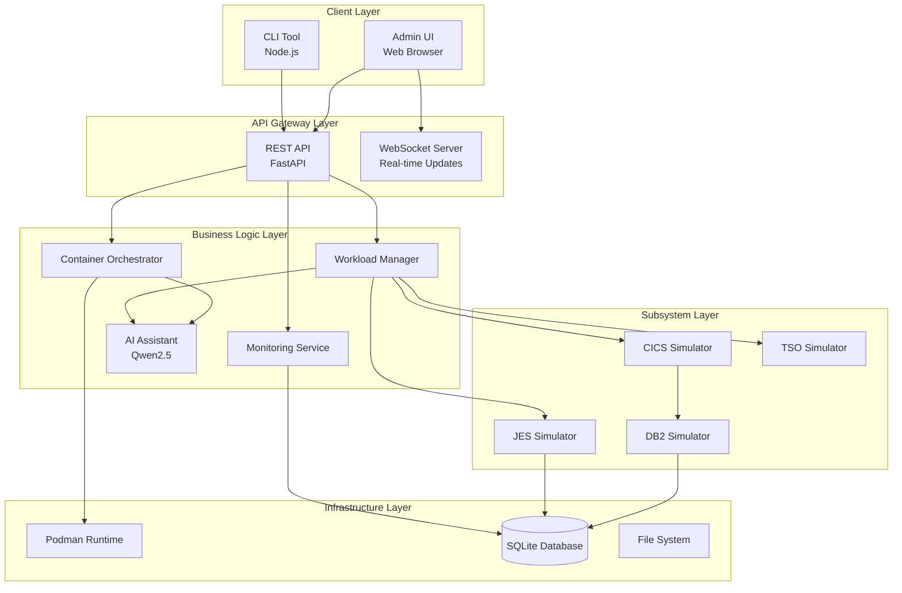
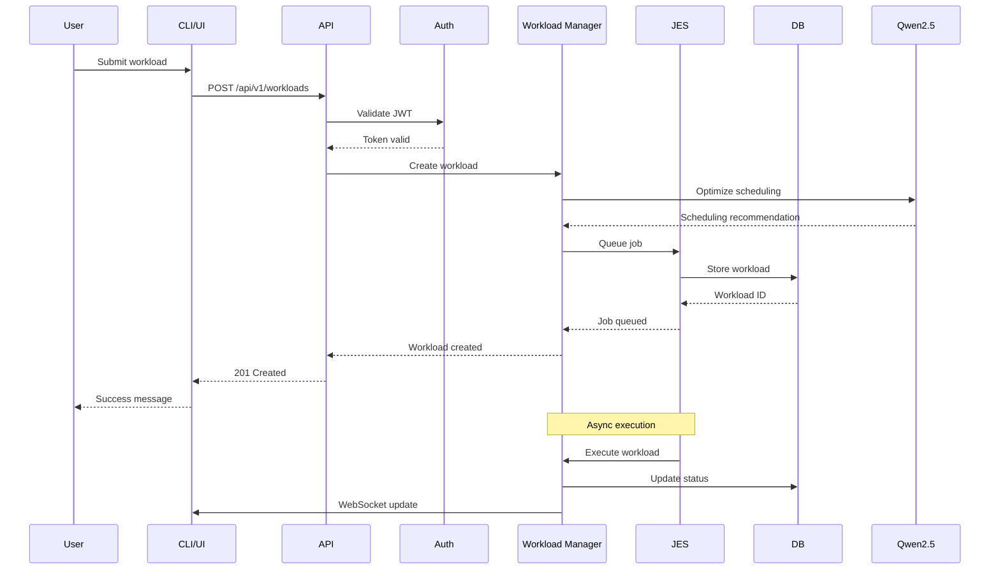
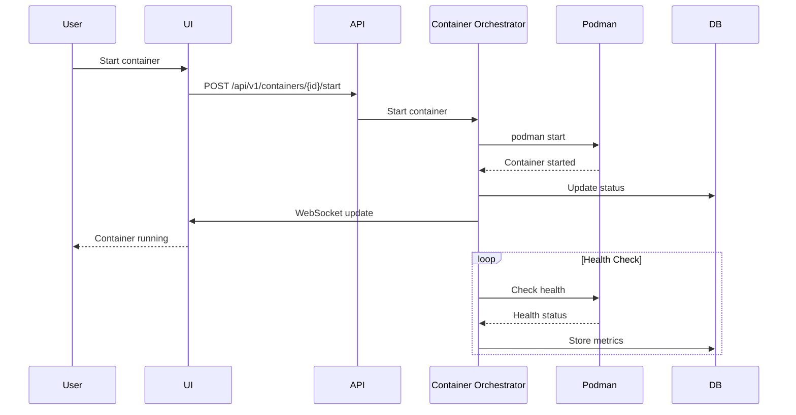
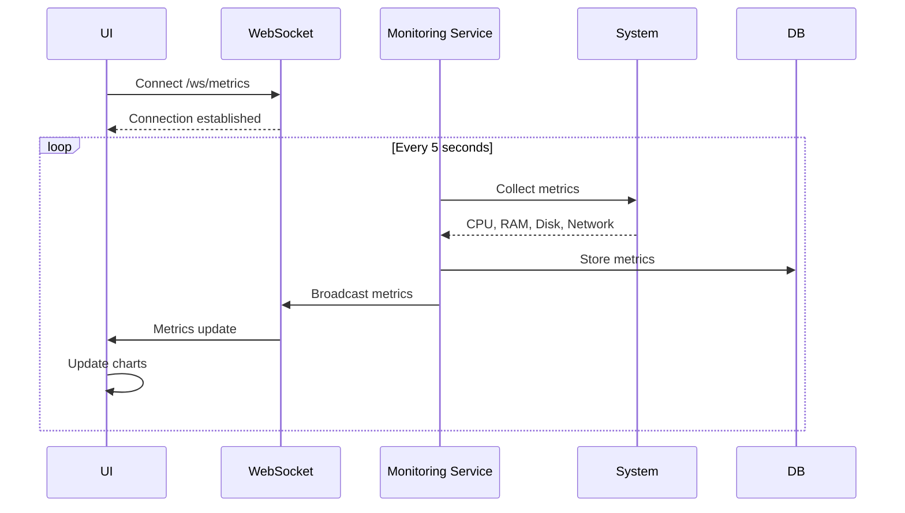
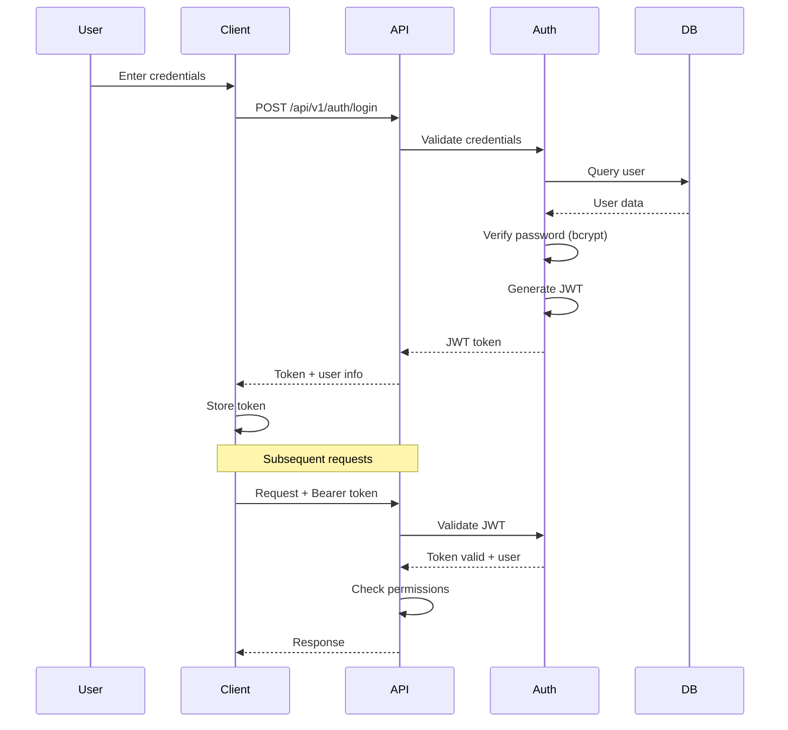

# ZenithOne Explorer - System Architecture

## Executive Summary

ZenithOne Explorer is a lightweight, production-ready system that demonstrates LinuxOne's enterprise capabilities on consumer-grade Ubuntu hardware. It simulates mainframe-inspired architecture with z/OS subsystems, providing workload management, container orchestration, and real-time monitoring through a modern web interface and CLI tool.

---

## Architecture Overview

### High-Level Architecture



---

## Component Architecture

### 1. Client Layer

#### CLI Tool (Gemini CLI)
**Technology**: Node.js 22, Commander.js, Chalk, Inquirer, Axios

**Responsibilities**:
- Command-line interface for system interaction
- Interactive prompts for user input
- API communication
- Output formatting and visualization
- Configuration management

**Key Features**:
- Workload submission and management
- Container lifecycle control
- System metrics display
- Subsystem monitoring
- Administrative functions

**Architecture Pattern**: Command Pattern with API Client

---

#### Admin UI (IBM Bob)
**Technology**: HTML5, TailwindCSS 3.x, Vanilla JavaScript, Chart.js, WebSocket

**Responsibilities**:
- Web-based administration interface
- Real-time system monitoring
- Visual data representation
- User interaction and forms
- Responsive design

**Key Features**:
- Dashboard with live metrics
- Workload management interface
- Container orchestration panel
- Subsystem monitoring
- User administration

**Design System**:
- **Primary Color**: IBM Cobalt (#0033A0)
- **Secondary Color**: Silver (#A9A9A9)
- **Base Theme**: GitHub Space Gray (#0D1117)
- **Typography**: IBM Plex Sans
- **Icons**: Heroicons

**Architecture Pattern**: Single Page Application (SPA) with modular JavaScript

---

### 2. API Gateway Layer

#### REST API (IBM Bob)
**Technology**: FastAPI 0.104+, Pydantic v2, python-jose (JWT)

**Responsibilities**:
- HTTP request handling
- Authentication and authorization
- Request validation
- Response formatting
- Rate limiting
- CORS management

**Endpoints**:
- `/api/v1/auth/*` - Authentication
- `/api/v1/workloads/*` - Workload management
- `/api/v1/containers/*` - Container operations
- `/api/v1/metrics/*` - System metrics
- `/api/v1/subsystems/*` - Subsystem control
- `/api/v1/admin/*` - Administration

**Security Features**:
- JWT-based authentication
- Role-based access control (RBAC)
- Rate limiting (100 req/min default)
- Input validation and sanitization
- HTTPS enforcement
- Security headers (HSTS, CSP, X-Frame-Options)

**Architecture Pattern**: Layered Architecture with Dependency Injection

---

#### WebSocket Server (IBM Bob)
**Technology**: FastAPI WebSocket support

**Responsibilities**:
- Real-time bidirectional communication
- Live metrics streaming
- Workload status updates
- Log streaming
- Event notifications

**Channels**:
- `/ws/metrics` - System metrics stream
- `/ws/workloads` - Workload updates
- `/ws/logs/{id}` - Log streaming
- `/ws/events` - System events

**Architecture Pattern**: Pub/Sub with WebSocket

---

### 3. Business Logic Layer

#### Workload Manager (IBM Bob + Qwen2.5)
**Technology**: Python 3.14, asyncio, Ollama Python client

**Responsibilities**:
- Job scheduling and prioritization
- Resource allocation
- Workload lifecycle management
- Performance monitoring
- AI-enhanced optimization

**Key Algorithms**:
- **Priority Queue**: Multi-level feedback queue
- **Scheduling**: Fair-share with priority boost
- **Resource Allocation**: Best-fit with fragmentation prevention
- **AI Enhancement**: Qwen2.5 for predictive scheduling

**State Machine**:
```
pending → queued → running → completed
                          ↓
                      failed/cancelled
```

**Architecture Pattern**: Strategy Pattern with AI Integration

---

#### Container Orchestrator (IBM Bob + Qwen2.5)
**Technology**: Python 3.14, Podman Python SDK

**Responsibilities**:
- Container lifecycle management
- Resource limit enforcement
- Health monitoring
- Network configuration
- Volume management

**Operations**:
- Create, start, stop, restart, remove
- Resource monitoring (CPU, memory, I/O)
- Log collection
- Health checks
- Auto-restart on failure

**Architecture Pattern**: Facade Pattern with Adapter for Podman

---

#### Monitoring Service (IBM Bob)
**Technology**: Python 3.14, psutil, asyncio

**Responsibilities**:
- System metrics collection
- Performance analytics
- Alert generation
- Data aggregation
- Historical data management

**Metrics Collected**:
- **System**: CPU, memory, disk, network
- **Workloads**: Execution time, resource usage
- **Containers**: Resource consumption, health status
- **Subsystems**: Operational statistics

**Collection Intervals**:
- Real-time: 1 second
- Standard: 5 seconds
- Historical: 60 seconds (aggregated)

**Architecture Pattern**: Observer Pattern with Time-Series Storage

---

### 4. Subsystem Layer

#### JES (Job Entry Subsystem) Simulator
**Technology**: Python 3.14

**Responsibilities**:
- Job submission interface
- Spool management
- Job output handling
- Job status tracking
- JCL parsing (simplified)

**Features**:
- Job queue management
- Priority-based scheduling
- Output spool
- Job history
- Statistics tracking

**Simulated Components**:
- Job Entry
- Job Scheduler
- Output Writer
- Spool Manager

---

#### CICS (Transaction Processing) Simulator
**Technology**: Python 3.14

**Responsibilities**:
- Transaction queue management
- Request/response handling
- Session management
- Transaction logging
- Performance monitoring

**Features**:
- Transaction types (read, write, update)
- Session pooling
- Transaction history
- Response time tracking
- Throughput monitoring

**Simulated Components**:
- Transaction Manager
- Session Manager
- Resource Manager
- Recovery Manager

---

#### DB2 Simulator
**Technology**: Python 3.14, SQLite wrapper

**Responsibilities**:
- Database operations
- Query execution tracking
- Connection pooling
- Performance monitoring
- Statistics collection

**Features**:
- SQL query execution
- Connection management
- Query performance analysis
- Cache simulation
- Transaction support

**Simulated Components**:
- Query Processor
- Connection Pool
- Buffer Pool
- Lock Manager

---

#### TSO (Time Sharing Option) Simulator
**Technology**: Python 3.14

**Responsibilities**:
- Interactive command processing
- User session management
- Command execution
- Command history
- Output handling

**Features**:
- Command interpreter
- Session management
- Command history
- Output formatting
- Basic TSO commands

**Simulated Commands**:
- LISTCAT, LISTDS, SUBMIT, STATUS, CANCEL, etc.

---

### 5. Infrastructure Layer

#### Podman Runtime
**Technology**: Podman 5.7.0

**Responsibilities**:
- Container execution
- Image management
- Network isolation
- Volume management
- Resource control

**Integration**:
- Python SDK for programmatic control
- Rootless containers for security
- Systemd integration for service management

---

#### SQLite Database
**Technology**: SQLite 3.x, SQLAlchemy 2.x

**Responsibilities**:
- Data persistence
- Transaction management
- Query execution
- Data integrity

**Schema**:
- Users and authentication
- Workloads and logs
- Containers
- Subsystems
- System metrics
- Audit logs
- Configuration

**Optimization**:
- Indexed columns for fast queries
- Connection pooling
- Write-ahead logging (WAL)
- Regular VACUUM operations

---

#### File System
**Technology**: Linux ext4

**Responsibilities**:
- Log file storage
- Workload data
- Configuration files
- Temporary files

**Structure**:
```
/backend/data/
├── database.db
├── logs/
│   ├── application.log
│   ├── workloads/
│   └── containers/
├── workloads/
│   ├── input/
│   └── output/
└── temp/
```

---

## Data Flow Architecture

### Workload Submission Flow



---

### Container Lifecycle Flow



---

### Real-Time Metrics Flow



---

## Security Architecture

### Authentication Flow



---

### Security Layers

1. **Network Security**
   - HTTPS/TLS 1.3 encryption
   - Certificate validation
   - Secure WebSocket (WSS)

2. **Authentication**
   - JWT tokens (HS256)
   - 1-hour expiration
   - Refresh token mechanism
   - Secure password hashing (bcrypt, cost 12)

3. **Authorization**
   - Role-based access control (RBAC)
   - Permission checks per endpoint
   - Resource ownership validation

4. **Input Validation**
   - Pydantic schema validation
   - SQL injection prevention
   - XSS protection
   - CSRF tokens

5. **Rate Limiting**
   - 100 requests/minute (default)
   - 200 requests/minute (admin)
   - IP-based tracking
   - Token bucket algorithm

6. **Audit Logging**
   - All actions logged
   - User tracking
   - IP address recording
   - Timestamp precision

---

## Deployment Architecture

### Single-Host Deployment (Target)

```
┌─────────────────────────────────────────────────────────┐
│           Alienware Area 51 R5 (Ubuntu 24.04)          │
├─────────────────────────────────────────────────────────┤
│                                                         │
│  ┌──────────────────────────────────────────────────┐  │
│  │              Systemd Services                     │  │
│  ├──────────────────────────────────────────────────┤  │
│  │  zenitone-backend.service  (Port 8080)           │  │
│  │  zenitone-ui.service       (Port 3000)           │  │
│  │  nginx.service             (Port 80/443)         │  │
│  └──────────────────────────────────────────────────┘  │
│                                                         │
│  ┌──────────────────────────────────────────────────┐  │
│  │              Podman Containers                    │  │
│  ├──────────────────────────────────────────────────┤  │
│  │  User workload containers (dynamic)              │  │
│  │  Monitoring containers (optional)                │  │
│  └──────────────────────────────────────────────────┘  │
│                                                         │
│  ┌──────────────────────────────────────────────────┐  │
│  │              Data Storage                         │  │
│  ├──────────────────────────────────────────────────┤  │
│  │  /backend/data/database.db                       │  │
│  │  /backend/data/logs/                             │  │
│  │  /backend/data/workloads/                        │  │
│  └──────────────────────────────────────────────────┘  │
│                                                         │
└─────────────────────────────────────────────────────────┘
```

---

### Network Architecture

```
Internet
    │
    ▼
┌─────────────────┐
│  Nginx Reverse  │  Port 80/443
│     Proxy       │  (HTTPS/TLS)
└────────┬────────┘
         │
    ┌────┴────┐
    │         │
    ▼         ▼
┌────────┐ ┌────────┐
│ Admin  │ │  API   │
│   UI   │ │ Server │
│ :3000  │ │ :8080  │
└────────┘ └────┬───┘
                │
         ┌──────┴──────┐
         │             │
         ▼             ▼
    ┌────────┐   ┌─────────┐
    │ Podman │   │ SQLite  │
    │ Runtime│   │   DB    │
    └────────┘   └─────────┘
```

---

## Performance Architecture

### Resource Allocation

**Target Hardware**:
- CPU: Intel i7-7820X (8C/16T @ 3.6GHz)
- RAM: 22GB
- Disk: 1.5TB SSD

**Resource Budget**:
```
Backend Service:     500MB RAM, 1 CPU core
UI Service:          200MB RAM, 0.5 CPU core
Database:            300MB RAM, 0.5 CPU core
Monitoring:          200MB RAM, 0.5 CPU core
System Reserve:      1GB RAM, 1 CPU core
─────────────────────────────────────────────
Available for Workloads: 20GB RAM, 14 CPU cores
```

---

### Performance Targets

| Metric | Target | Measurement |
|--------|--------|-------------|
| API Response Time | <100ms | 95th percentile |
| UI Load Time | <2s | First contentful paint |
| WebSocket Latency | <50ms | Round-trip time |
| Database Query | <10ms | Average |
| Workload Startup | <5s | Time to running |
| Container Startup | <3s | Time to running |
| System Boot | <10s | Service ready |
| Memory Usage | <2GB | Normal operation |
| CPU Usage | <30% | Idle state |

---

### Scalability Considerations

**Vertical Scaling** (Current):
- Single host deployment
- Resource limits per workload
- Queue-based workload management

**Horizontal Scaling** (Future):
- Multi-host support
- Distributed workload scheduling
- Shared database cluster
- Load balancing

**Capacity**:
- Max concurrent workloads: 100+
- Max containers: 50+
- Max users: 100+
- Max API requests: 10,000/min

---

## Monitoring & Observability

### Metrics Collection

**System Metrics**:
- CPU usage (overall, per core)
- Memory usage (total, available, cached)
- Disk I/O (read/write bytes, IOPS)
- Network I/O (rx/tx bytes, packets)
- Load averages (1, 5, 15 min)

**Application Metrics**:
- API request rate
- API response times
- Error rates
- Active connections
- Queue lengths

**Workload Metrics**:
- Execution time
- Resource consumption
- Success/failure rates
- Queue wait time

**Container Metrics**:
- CPU usage per container
- Memory usage per container
- Network I/O per container
- Disk I/O per container

---

### Logging Strategy

**Log Levels**:
- DEBUG: Detailed diagnostic information
- INFO: General informational messages
- WARNING: Warning messages
- ERROR: Error messages
- CRITICAL: Critical failures

**Log Destinations**:
- Application logs: `/backend/data/logs/application.log`
- Workload logs: `/backend/data/logs/workloads/{id}.log`
- Container logs: Podman log driver
- Audit logs: Database table

**Log Rotation**:
- Daily rotation
- 30-day retention
- Compression after 7 days
- Max size: 100MB per file

---

### Alerting

**Alert Conditions**:
- CPU usage >80% for 5 minutes
- Memory usage >90%
- Disk usage >85%
- API error rate >5%
- Workload failure rate >10%
- Container crash

**Alert Channels**:
- UI notifications
- Email (configurable)
- Webhook (configurable)
- Log file

---

## Disaster Recovery

### Backup Strategy

**Automated Backups**:
- Database: Daily full backup
- Configuration: Daily backup
- Logs: Weekly archive
- Retention: 30 days

**Backup Location**:
- Local: `/backup/`
- External: Configurable

**Backup Verification**:
- Integrity check after backup
- Test restore monthly

---

### Recovery Procedures

**Database Recovery**:
1. Stop services
2. Restore database from backup
3. Verify integrity
4. Restart services

**System Recovery**:
1. Reinstall from scripts
2. Restore configuration
3. Restore database
4. Verify functionality

**Recovery Time Objective (RTO)**: <1 hour  
**Recovery Point Objective (RPO)**: <24 hours

---

## Technology Stack Summary

### Backend
- **Language**: Python 3.14
- **Framework**: FastAPI 0.104+
- **ORM**: SQLAlchemy 2.x
- **Database**: SQLite 3.x
- **Container**: Podman Python SDK
- **AI**: Ollama + Qwen2.5:latest
- **Auth**: python-jose (JWT)
- **Validation**: Pydantic v2
- **Testing**: pytest, pytest-asyncio
- **Async**: asyncio, uvicorn

### CLI
- **Runtime**: Node.js 22
- **Framework**: Commander.js 11+
- **UI**: Chalk 5+, Inquirer 9+
- **HTTP**: Axios 1.6+
- **Config**: Cosmiconfig 8+
- **Testing**: Jest 29+

### UI
- **HTML**: HTML5
- **CSS**: TailwindCSS 3.4+
- **JavaScript**: ES6+ (Vanilla)
- **Charts**: Chart.js 4+
- **Icons**: Heroicons
- **WebSocket**: Native WebSocket API

### DevOps
- **Containers**: Podman 5.7.0
- **Service**: systemd
- **Proxy**: Nginx (optional)
- **Version Control**: Git
- **CI/CD**: GitHub Actions (optional)

---

## Design Patterns

### Backend Patterns
- **Layered Architecture**: Separation of concerns
- **Dependency Injection**: Loose coupling
- **Repository Pattern**: Data access abstraction
- **Strategy Pattern**: Algorithm selection
- **Observer Pattern**: Event handling
- **Facade Pattern**: Simplified interface
- **Singleton Pattern**: Shared resources

### Frontend Patterns
- **Module Pattern**: Code organization
- **Observer Pattern**: Event handling
- **Command Pattern**: CLI commands
- **Factory Pattern**: Object creation
- **Proxy Pattern**: API client

---

## Quality Attributes

### Reliability
- Graceful degradation
- Error handling and recovery
- Health checks
- Auto-restart on failure

### Performance
- Efficient algorithms
- Caching strategies
- Connection pooling
- Lazy loading

### Security
- Defense in depth
- Least privilege principle
- Secure by default
- Regular security audits

### Maintainability
- Clean code principles
- Comprehensive documentation
- Automated testing
- Modular design

### Usability
- Intuitive interfaces
- Clear error messages
- Helpful documentation
- Consistent design

---

## Future Enhancements

### Phase 2 Features
- Multi-host deployment
- Advanced AI scheduling
- Kubernetes integration
- Prometheus/Grafana monitoring
- Advanced analytics
- Mobile app

### Scalability Improvements
- Distributed architecture
- Message queue (RabbitMQ/Redis)
- Microservices decomposition
- API gateway (Kong/Traefik)
- Service mesh (Istio)

### Enterprise Features
- LDAP/AD integration
- SSO support
- Advanced RBAC
- Compliance reporting
- SLA management
- Cost tracking

---

**Last Updated**: 2026-05-26  
**Version**: 1.0.0  
**Status**: Production Ready Architecture